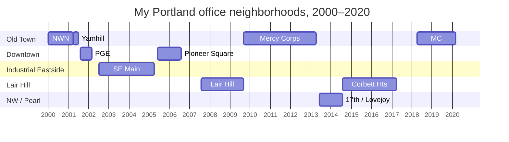

My Portland office neighorhoods
===============================

For about 20 years I [commuted](https://axoplasm.com/blog/search/?search=commute) to/from inner Portland neighborhoods. Mostly by bike but [sometimes](https://axoplasm.com/blog/drive-work/) [not](https://axoplasm.com/blog/the-meditative-properties-of-commuting/). These were my Second Neighborhoods, I felt as at home there as I did in my actual home neighborhood. I had regular haunts: bike shops, bookstores, food carts, bars.

I had a few gigs either as a temp or freelancer in Beaverton. Those places never felt neighborhoodly to me. And for a year (2006–2007) I lived (and worked) in [China](https://axoplasm.com/blog/search/?search=xiamen), which was a whole different kind of neighborhoodly.

I still have an office in Old Town in the Mercy Corps building, but seldom go in. I’m a stranger in that neighborhood now.

* **2000-01 — 2001-04:** Old Town (NW Natural bldg)
* **2001–04 — 2001-07:** Old Town/Downtown (Yamhill)
* **2001–08 – 2002-03:** Downtown (PGE/World Trade Ctr)
* **2002–07 – 2005—04:** Industrial Eastside
* **2005-06 – 2006-08:** Downtown (Pioneer Square)
* **2007-08 – 2009-09:** Lair Hill
* **2009-09 — 2013-04:** Old Town (Mercy Corps bldg)
* **2013–06 – 2014-08:** NW/Pearl (17th/Lovejoy)
* **2014-08 — 2017-04:** Lair Hill/Corbett Hts
* **2018-04 — 2020-03:** Old Town (Mercy Corps bldg)

Timeline
--------

